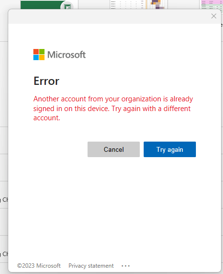

# MicrosoftAccountPicker



Hello! I work in IT and have encountered the following error multiple times:

> **"Another account from your organization is already signed in on this device. Try again with a different account."**

This error occurs when multiple Microsoft work or school accounts are linked or signed in on the same computer, causing Office apps to get confused about which account to use.

To fix this issue manually, you need to navigate to the directory:

"C:\Users\user1\AppData\Local\Microsoft\OneAuth\accounts"

and look through the files to change their association status to select the account you want to use.

When I was troubleshooting this, I found many files and going one-by-one to find the correct account (like my coworker’s) wasn’t fun. So, I created this PowerShell script with a simple GUI to help change the association status of the files easily.

I wanted to upload this program to help other people in the IT field, or anyone who has seen this message and doesn’t want to have to look through a bunch of files and edit them one by one to get to the account they want.

[app img]

## Usage

- Launch the script.
- A window will open showing the email accounts inside the directory.
- Use the 'Associate' or 'Disassociate' buttons to select the account you want to associate.

## Installation

To use this program:
Make sure your PowerShell execution policy is set to `RemoteSigned`. You can do this by opening PowerShell as Administrator and running:

```powershell
Set-ExecutionPolicy RemoteSigned
```

After you can run the script by right-clicking the .ps1 file and selecting Run with PowerShell.
